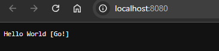

# TutoGo: "Hello World" Application in Go

**TutoGo** is a simple Go application that displays a "Hello, World!" message in the browser. This project is ideal for getting started with Go and learning how to run a basic application in this language, both locally and within a Docker container.

<div align="center">
    
</div>

## Requirements

- **Go**: Version 1.18 or higher.
- **Docker** (optional): To run in a container.

## Installation and Execution

1. **Install Go**: Download and install Go from the official site according to your operating system.

2. **Clone the Repository**: Clone this repository to your local machine using Git:
   ```bash
   git clone https://github.com/Jonablo/tutoGo.git
   cd tutoGo
   ```

3. **Run the Application Locally**: Navigate to the project folder and execute the following command:
   ```bash
   go run hello.go
   ```
   This will start a web server on `http://localhost:8080`, where you can see the "Hello, World!" message in your browser.

4. **Run with Docker**: If you prefer to run the application in a Docker container, build the Docker image using the following command:
   ```bash
   docker build -t jonablo/tuto-go-app .
   ```
   Then, run the Docker container with the following command:
   ```bash
   docker run -p 8080:8080 jonablo/tuto-go-app
   ```
   This will start the web server inside the container, and you can access the application at `http://localhost:8080`.

## Contributions

If you'd like to contribute to this project, feel free to fork the repository and submit a pull request with your improvements.

## License

This project is licensed under the [MIT License](LICENSE).